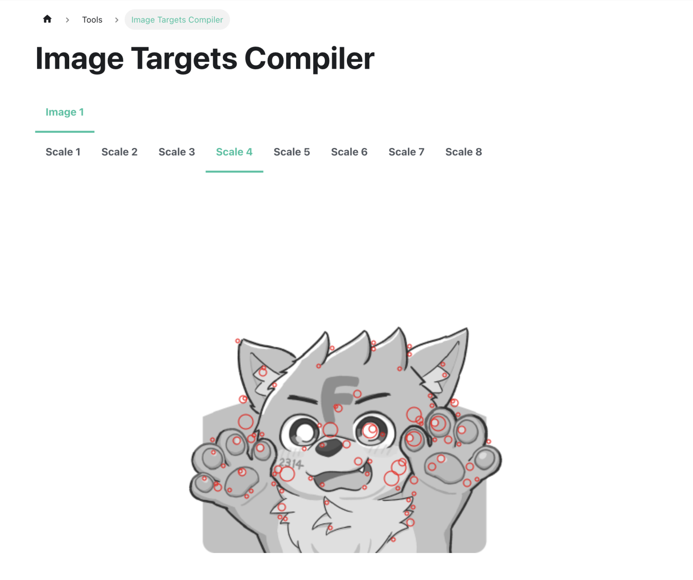

# ふぉくしーどAR
リアルイベントでふぉくしーどが配布する名刺をかざすと、ARコンテンツを楽しめるサイトです。

## 🎥 動作様子
https://x.com/foxseed2314/status/1923211818064851354

## 🛠 環境構築
開発には以下が必要です。

- Node.js v22.14.0 以上

はじめにリポジトリをクローンし、依存関係をインストールしてください。

```sh
git clone https://github.com/foxseedlab/foxseed-ar.git

cd foxseed-ar

npm install
```

次に .env.sample を .env にコピーし、環境変数の設定を行ってください。

```sh
cp .env.sample .env
```

## 💻 コマンド
| コマンド | 説明 |
| --- | --- |
| `npm run dev` | 開発サーバーを起動 |
| `npm run build` | TypeScriptのビルドとViteビルドを実行 |
| `npm run preview` | ビルドしたファイルをプレビュー |
| `npm run deploy` | ビルドして Cloudflare Workers にデプロイ |
| `npm run d1:generate` | Drizzleの型定義を生成 |
| `npm run d1:migrate` | Drizzleのマイグレーションを実行 |
| `npm run cf-typegen` | Cloudflare Workers の型定義を生成 |

## 📁 リポジトリ構造
```sh
/
├── dist/                  # ビルド出力先
│   ├── client/            # クライアントサイドのビルド
│   └── foxseed_ar/        # Cloudflare Workers のビルド
├── public/                # 静的ファイル（画像など）
├── src/                   # クライアントサイドのソースコード
│   ├── App.tsx            # ルートアプリケーションコンポーネント
│   ├── index.css          # グローバルCSS
│   ├── index.tsx          # エントリーポイント
│   └── vite-env.d.ts      # Vite環境の型定義
├── worker/                # サーバーサイドのソースコード
├── drizzle/              # Drizzle ORMの設定とマイグレーション
├── .vscode/              # VSCode設定
├── .wrangler/            # Wranglerの設定
├── biome.jsonc           # Biome設定ファイル
├── drizzle.config.ts     # Drizzle設定
├── index.html            # HTMLエントリーポイント
├── tsconfig.json         # TypeScript基本設定
├── tsconfig.app.json     # アプリケーション用TypeScript設定
├── tsconfig.worker.json  # Worker用TypeScript設定
├── tsconfig.node.json    # Node.js用TypeScript設定
├── vite.config.ts        # Vite設定ファイル
├── wrangler.jsonc        # Cloudflare Workers の設定
├── worker-configuration.d.ts # Worker設定の型定義
└── package.json          # 依存関係とスクリプト
```

## 🔀 ブランチ戦略
[GitHub Flow](https://docs.github.com/en/get-started/quickstart/github-flow) を採用しています。

## 🌠 ARマーカーについて
[MindAR Image Targets Compiler](https://hiukim.github.io/mind-ar-js-doc/tools/compile/) を用いて、ふぉくしーどカードの被写体部分を画像マーカーにしています。 `Scale 4` でコンパイルを行いました。



<div align="center">
<small>
© 2025 ふぉくしーど
</small>
</div>
